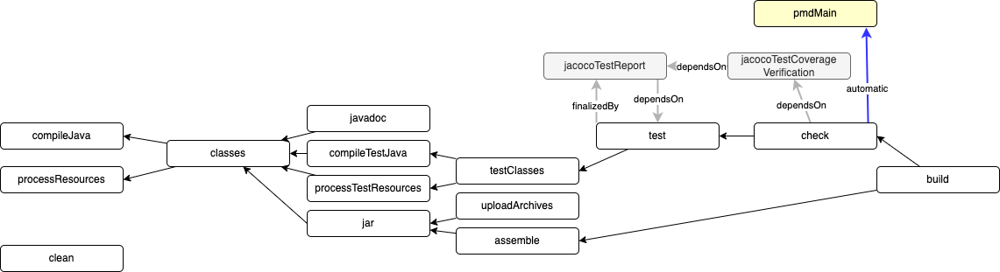
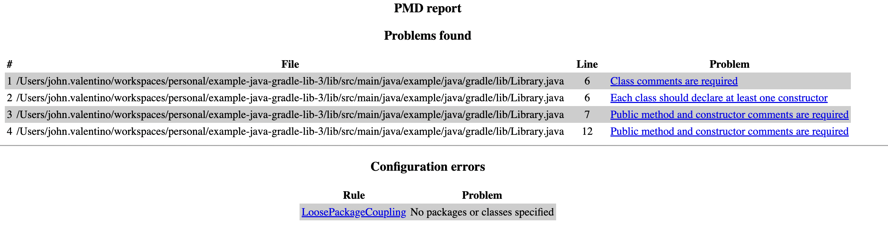
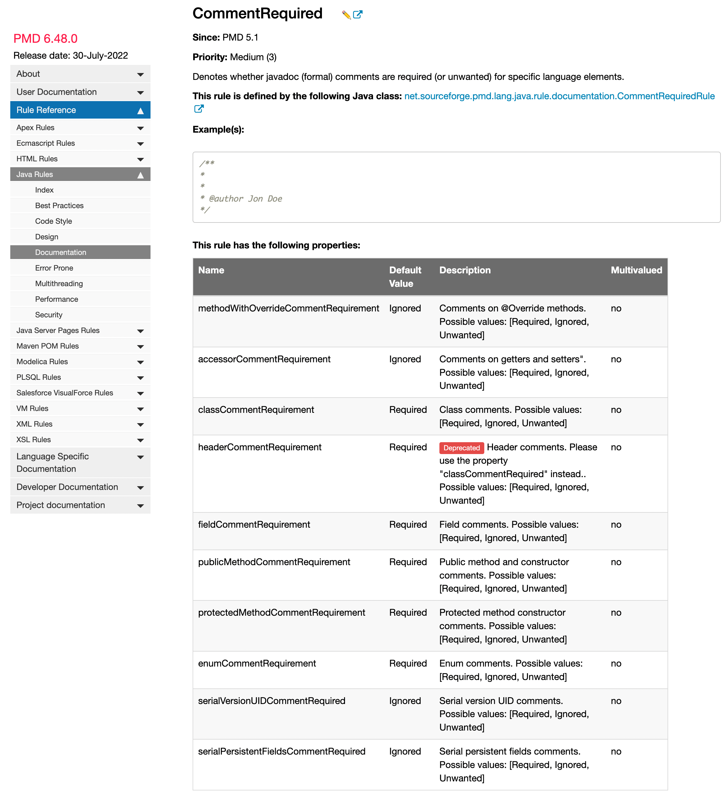

# Example Java Library using Gradle: Part 3

The purpose of this project is to be a basic Java library that is built using Gradle, with the intention of showing how to add static code analysis with a quality gate via PMD.

Prerequisites

- Git Setup: https://github.com/jvalentino/setup-git
- Building Java 101: https://github.com/jvalentino/java-building-101
- Gradle-Java Part 1: https://github.com/jvalentino/example-java-gradle-lib-1
- Gradle-Java Part 2: https://github.com/jvalentino/example-java-gradle-lib-2

# (1) What is static code analysis?

> In [computer science](https://en.wikipedia.org/wiki/Computer_science), **static program analysis** (or **static analysis**) is the [analysis](https://en.wikipedia.org/wiki/Program_analysis) of computer programs performed without executing them, in contrast with [dynamic program analysis](https://en.wikipedia.org/wiki/Dynamic_program_analysis), which is performed on programs during their execution.[[1\]](https://en.wikipedia.org/wiki/Static_program_analysis#cite_note-1)[[2\]](https://en.wikipedia.org/wiki/Static_program_analysis#cite_note-2)
>
> The term is usually applied to analysis performed by an automated tool, with human analysis typically being called "program understanding", [program comprehension](https://en.wikipedia.org/wiki/Program_comprehension), or [code review](https://en.wikipedia.org/wiki/Code_review). In the last of these, [software inspection](https://en.wikipedia.org/wiki/Software_inspection) and [software walkthroughs](https://en.wikipedia.org/wiki/Software_walkthrough) are also used. In most cases the analysis is performed on some version of a program's [source code](https://en.wikipedia.org/wiki/Source_code), and, in other cases, on some form of its [object code](https://en.wikipedia.org/wiki/Object_code)

- https://en.wikipedia.org/wiki/Static_program_analysis

# (2) What is PMD?

> PMD is a source code analyzer. It finds common programming flaws like unused variables, empty catch blocks, unnecessary object creation, and so forth. It supports Java, JavaScript, Salesforce.com Apex and Visualforce, PLSQL, Apache Velocity, XML, XSL.
>
> Additionally it includes CPD, the copy-paste-detector. CPD finds duplicated code in Java, C, C++, C#, Groovy, PHP, Ruby, Fortran, JavaScript, PLSQL, Apache Velocity, Scala, Objective C, Matlab, Python, Go, Swift and Salesforce.com Apex and Visualforce.

- https://pmd.github.io/

# (3) Using the PMD Plugin

## build.gradle

```groovy
plugins {
    // Apply the java-library plugin for API and implementation separation.
    id 'java-library'
    // JACACO!
    id 'jacoco'
    // PMD!
    id 'pmd'
}

// ...

// PMD!
pmd {
    ruleSets = ["config/pmd-java.xml"]
}
```

## config/pmd-java.xml

PMD requires a ruleset, and this file is every single PMD rule available from java, as obtained from https://github.com/pmd/pmd/blob/master/pmd-core/src/main/resources/rulesets/internal/all-java.xml


## How does this work?



## Running it

```bash
$ ./gradlew clean check -i

> Configure project :lib
> Task :lib:clean
> Task :lib:compileJava
> Task :lib:processResources NO-SOURCE
> Task :lib:classes
> Task :lib:jar
> Task :lib:assemble
> Task :lib:compileTestJava
> Task :lib:processTestResources NO-SOURCE
> Task :lib:testClasses
> Task :lib:test
> Task :lib:jacocoTestReport
> Task :lib:jacocoTestCoverageVerification
> Task :lib:pmdMain FAILED

FAILURE: Build failed with an exception.

* What went wrong:
Execution failed for task ':lib:pmdMain'.
> 4 PMD rule violations were found. See the report at: lib/build/reports/pmd/main.html

```

Yep, it failed because there are violations which can be seen at lib/build/reports/pmd/main.html





## Handling failures

You have the following options at this point:

1. Fix all the failures, which can be cost prohibitive all at one
2. Ignore all the failures, which makes the reporting mostly useless
3. Not allow us to add any new failures, which definately requires dev buy-in

The most reasonable approach is usually going to be option 3:

```bash
// PMD!
pmd {
    ruleSets = ["config/pmd-java.xml"]
    maxFailures = 4
}
```

This is so that you can can back later (especially if there are hundreds of thousands of issues), and start addressing them one at a time while not allowing new issues to be added.

